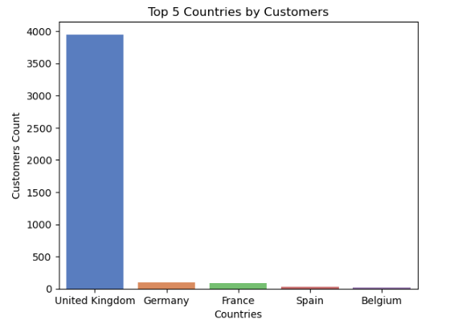
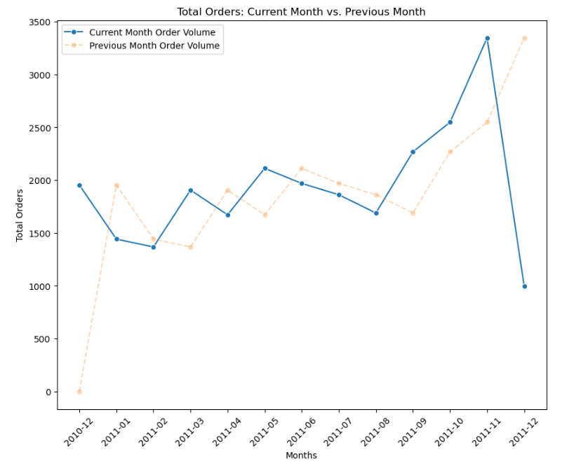
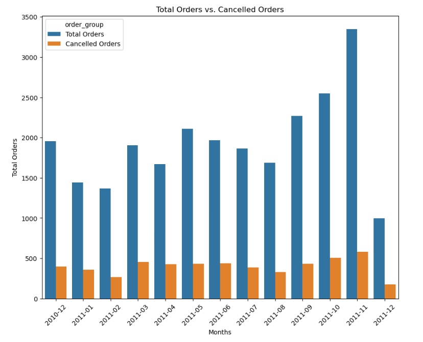
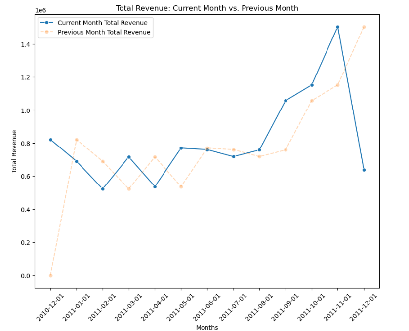
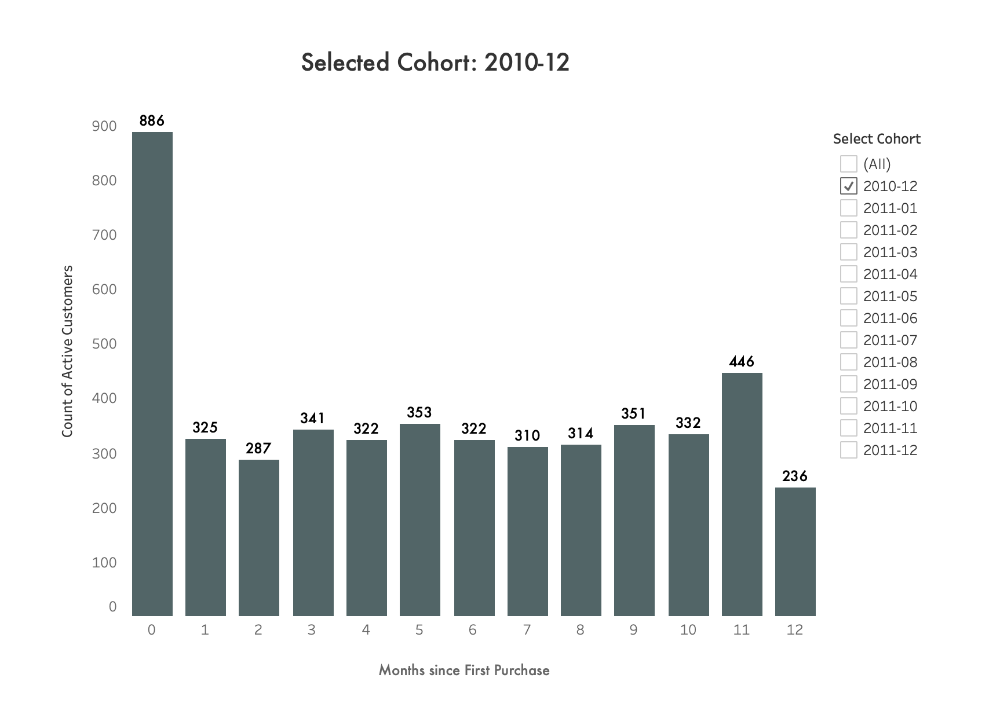

# Comprehensive Retail Analytics: RFM Segmentation, Customer Cohort Analysis & Cross-Sales Intelligence

## Project Overview

This portfolio project demonstrates a complete data analytics workflow applied to the UCI Online Retail dataset. The work encompasses data acquisition, quality assurance, exploratory investigation, and sophisticated analytical modeling to uncover actionable business intelligence. The technical stack includes SQL for data engineering and Python (Pandas, Seaborn, Matplotlib) for analytical visualization. Three core methodologies were implemented: RFM customer segmentation, temporal cohort analysis, and association pattern mining.

## [Interactive Dashboard](https://public.tableau.com/app/profile/paritosh.sharma.ghimire/viz/retail_analysis_dash/DashboardLanding)

## Data Pipeline & Foundation Architecture

### Data Acquisition and Initial Processing

[View Migration Script](preprocessing/load_and_transform/migration_to_normalised_tables.sql)

The analytical foundation begins with extracting the raw transaction dataset from an XLSX source file. A Python utility automated the conversion to CSV format, facilitating seamless import into a PostgreSQL staging environment. Initial null values in customer identifiers were systematically replaced with default placeholders to maintain referential integrity throughout the analytical pipeline.

## Data Validation and Standardization Protocol

[View Quality Assurance Queries](preprocessing/data_quality_check.sql)

A structured framework was implemented to ensure data integrity and consistency:

- **Duplicate Record Elimination:**  
  Redundant records were systematically identified and removed to prevent analytical bias.

- **Transaction Status Classification:**  
  Negative quantity values were flagged as cancelled transactions. A dedicated status indicator (`is_cancelled`) was introduced for granular tracking.

- **Unit Price Reconciliation:**  
  - Initial assessment identified 1,180 records with zero unit prices across 683 product codes.
  - Contextual analysis revealed non-transactional records (e.g., stock codes: `M` [Manual adjustments], `B` [Bad debt adjustments], `BANK CHARGES`) that fell outside consumer transaction scope.
  - These non-transactional items and records with missing customer data were excluded from the dataset (1,134 records removed).
  - Of the remaining outliers, mean-value imputation was applied to standardize pricing.
  - Post-cleaning verification confirmed zero unit prices exclusively appeared in cancelled transactions.
  - Final anomalies were resolved using statistical imputation to ensure revenue accuracy.

- **Product Description Normalization:**  
  Missing descriptions in cancelled orders were replaced with a standardized placeholder message.

- **Temporal Data Validation:**  
  All invoice timestamps underwent validation checks, confirming data integrity across the time dimension.

- **Outcome:**  
  The cleaned staging dataset offered a reliable foundation for subsequent analytical modeling.

## Exploratory Data Investigation

[View Analysis Notebook](EDA/eda.ipynb)

### Customer Demographics and Behavioral Patterns

- **Customer Population Composition:**  
  Dataset analysis identified 4,372 distinct customers, with geographic concentration heavily weighted toward the United Kingdom market (90% of customer base).

  

- **Transaction Frequency Distribution:**  
  Excluding system-generated placeholder customer identifiers, the analysis revealed pronounced distribution skewness:
  - Peak engagement: individual customers executed over 248 purchase transactions
  - Central tendency: mean of 5 transactions per customer, median of 3
  - Distribution pattern: right-skewed, indicating a concentrated high-value segment

  

### Revenue Metrics and Temporal Trends

- **Sales Timeline and Seasonal Patterns:**  
  Transactions spanned 408 days across fiscal periods. Month-over-month comparative analysis illuminated seasonal demand fluctuations with distinct peaks and troughs.

- **Order Cancellation Analysis:**  
  Cancelled orders represented 20.58% of total transaction volume. Temporal decomposition revealed:
  - Peak cancellation rate: 25.48% (April 2011)
  - Substantial month-to-month volatility throughout the observation period

  

- **Revenue Performance Indicators:**
  - Completed transaction revenue: approximately 10.64M
  - Revenue attrition from cancellations: approximately 894K
  - Time-series decomposition identified notable revenue contraction in December 2011

    

## Advanced Analytical Methodologies

### Recency-Frequency-Monetary (RFM) Customer Segmentation

[View Segmentation Model](Analysis/rfm_analysis.sql)

- **Strategic Objective:**  
  Classify customers into actionable segments based on purchase behavior and value metrics to enable targeted engagement strategies.

- **Analytical Framework:**  
  - Each customer dimension (recency, frequency, monetary) was scored across a 1-5 scale
  - Recency: temporal distance to latest transaction
  - Frequency: count of completed purchase transactions
  - Monetary: cumulative customer lifetime value
  - Composite RFM score: sum of individual dimension scores
  - Segment classification derived from score-based thresholds

  

- **Segment Classification:**
  - **Champions (7.93%):** Highest-value customers with recent activity, high transaction frequency, and strong monetary contribution
  - **Loyal Active (24.55%):** Consistent repeat customers with moderate engagement patterns
  - **Dormant/Inactive (26.00%):** Moderate risk segment requiring re-engagement initiatives to stimulate repeat purchases
  - **Returning Engaged (20.82%):** Customers with demonstrated loyalty patterns and consistent transaction history
  - **Inactive Base (20.70%):** Extended period since last engagement; candidates for lifecycle recovery programs

- **Business Application:**  
  The segmentation framework enables precision marketing allocation, allowing resources to concentrate on champion retention while designing win-back strategies for dormant segments.

### Customer Lifecycle Cohort Analysis

[View Cohort Analysis Model](Analysis/cohert_analysis.sql)

- **Strategic Objective:**  
  Group customers by the month of their first purchase to understand retention and loyalty patterns over time.

- **Analytical Approach:**  
  - The first transaction date was determined for each customer, establishing cohort membership
  - Subsequent purchase activity was tracked on a monthly basis to assess retention rates
  - Longitudinal patterns revealed customer lifetime trajectories and churn indicators

  

- **Business Insights:**  
  The cohort methodology provided insights into customer lifetime value trajectories, retention trends, and periods of elevated churn or improved loyalty, enabling proactive lifecycle management.

### Cross-Product Association Mining

[View Market Basket Model](Analysis/cohert_analysis.sql)

- **Strategic Objective:**  
  Identify products frequently purchased together to uncover cross-selling opportunities and optimize product bundling strategies.

- **Analytical Methodology:**  
  - Self-join operations paired products within identical invoices
  - A condition (`a.stock_code < b.stock_code`) ensured each unique product pairing was counted once
  - Co-occurrence frequency was aggregated and filtered to highlight significant associations

  

- **Business Application:**  
  Product association insights inform recommendation algorithms and enable strategic bundled promotions, optimizing basket value and customer satisfaction.

### Temporal Forecasting and Seasonality Analysis

- **Strategic Objective:**  
  Forecast future sales trends and quantify seasonal patterns to inform inventory and marketing planning.

- **Analytical Approach:**  
  - Sales transactions were aggregated into monthly periods using SQL
  - Time-series decomposition was performed using Python analytics libraries (Pandas, Seaborn, Matplotlib)
  - Seasonal patterns and trend components were isolated and visualized

- **Strategic Value:**  
  Predictive insights enable proactive inventory optimization and coordinated marketing campaigns, positioning the business to capitalize on anticipated seasonal demand variations.

## Project Conclusions

This end-to-end analysis of the UCI Online Retail dataset demonstrates the complete lifecycle of enterprise data analytics:

- **Data Engineering Foundation:**  
  Rigorous data acquisition, validation, and standardization transformed raw transactional records into a high-quality analytical dataset.

- **Exploratory Business Intelligence:**  
  Systematic investigation revealed customer demographics, revenue patterns, and behavioral trends underlying business performance.

- **Advanced Analytics and Strategy:**  
  RFM segmentation, cohort analysis, and association mining translated raw data into actionable strategies for customer lifetime value optimization, targeted marketing, and revenue growth.
